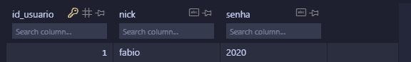
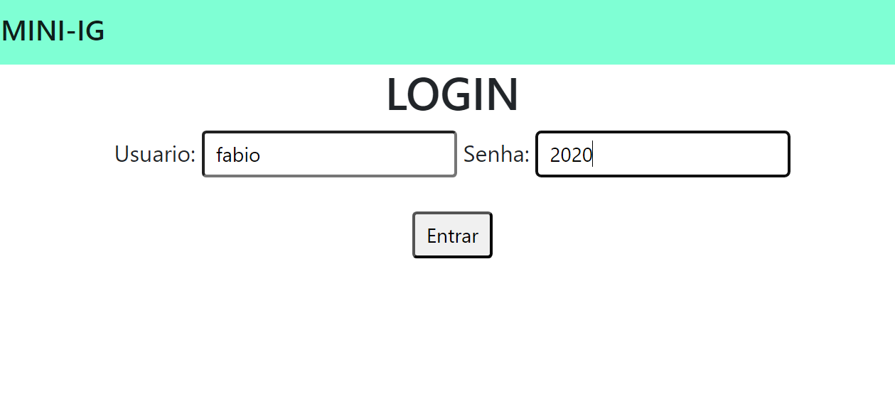
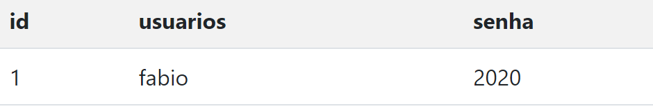

# T3 e T4

1. Como o django já nos proporciona um banco de dados integrado ***(SQLITE)*** a parte t3 e t4 estarão no tutorial a seguir:

2. Após a instalação do Django e abertura de um projeto, faremos a abertura de uma pasta de app.
~~~~
    django-admin starapp
~~~~

3. Registre o nome que você botou nesse aplicativo em settings.py, essa pasta se encontra no projeto original:
 Adicione no final de todos os outros já adicionados o nome da sua pasta de aplicativo criada.
~~~~
INSTALLED_APPS = [
    'django.contrib.admin',
    'django.contrib.auth',
    'django.contrib.contenttypes',
    'django.contrib.sessions',
    'django.contrib.messages',
    'django.contrib.staticfiles',
    'app_cadastro',
]
~~~~

4. Após essa criação, você irá em "urls.py" que estará dentro da pasta de projeto para configurar a rota, view e nome de referência, primeiramente dentro do arquivo urls você fará o seguinte import: 
~~~
from app_cadastro import views
~~~
5. Após isso dentro de urlpatterns irá modificar o path para:
~~~
urlpatterns = [
    path('',views.home, name='home'),
~~~
Onde o primeiro campo você não precisa modificar, o segundo é modificado com base na função que criará em views e o terceiro é só o nome de referência.

6. No arquivo views.py irá criar uma função com o nome igual a que botou no segundo campo de path e irá referenciar a página html criada.
~~~
def home(request):
     return render (request,'usuarios/home.html')
~~~
7. Para criar uma página html que seja enxergada pelo Django, entre na sua pasta de app criada, dentro dela, crie uma pasta com o nome ***templates***, e em templates crie uma subpasta para dentro dela colocar um arquivo html.

8. Já pode testar para ver se tudo correu bem até aqui usando o comando: 

~~~
python .\manage.py runserver
~~~

10. No html crie um form e dentro dele usando django crie uma listagem de usuários ou o nome que preferir com a seguinte sintaxe:
~~~
<form action="" method='post'> 
    
        

        <h1>LOGIN</h1>
        Usuario: <input name="nick" class="form-control-sm" type="text">
        Senha: <input name="senha" class="form-control-sm"type="text">
         
         
        <button class="form-control-sm">Entrar</button>
     
     

    </form>

~~~

11. Com essa listagem feita, adicione ela ao urls.py:
~~~
urlpatterns = [
    path('',views.home, name='home'),
    path('usuarios/',views.usuarios, name='listagem_usuarios'),
]
~~~

12. Em views.py, crie uma nova view que vai conter todos os dados a seguir para poder puxar informações do banco de dados, para podermos armazenar e recuperar esses dados:
~~~
def usuarios(request):
    novo_usuario = Usuario()
    novo_usuario.usuario = request.POST.get('nick')
    novo_usuario.senha = request.POST.get('senha')
    novo_usuario.save()

~~~

13. Basicamente o código acima é usado para que cada vez que adicionemos um usuário, ele seja colocado na tabela normalmente, ou seja, salvar os dados da tela pro banco de dados.

14. Para buscarmos informações no banco de dados adicionamos essas informações a um dicionário
~~~
usuarios = {
    'usuarios': Usuario.objects.all()
    
    }
~~~

15. A linha de código abaixo é feita aliada a um arquivo html para podermos listar os usuarios em uma página separada.

~~~~
 return render (request,'usuarios/usuarios.html',usuarios)
~~~~

16. Em models.py crie uma classe parra poder dizer o que haverá dentro da tabela:
~~~
class Usuario(models.Model):
    id_usuario = models.AutoField(primary_key=True)
    nick = models.TextField(max_length=255)
    senha = models.TextField(max_length=255)
~~~

17. Agora usaremos dois comandos no terminal, para primeiro transformar de código python para sql e após isso, fazer as tabelas no banco, certifique-se de sempre estar na pasta que há o manage.py para poder executar os comandos a seguir:
~~~
python .\manage.py makemigrations
~~~
~~~
python .\manage.py migrate   
~~~

18. Por meio da extensão SQLITE VIWER, é possivel verificar as tabelas criadas:

19. Em um novo arquivo html seguiremos a seguinte sintaxe parar podermos fazer uma tabela para aprersentar os dados, com um for em django para podermos listar todos os dados:
~~~~
div class="container">
    <table class="table table-boarded table-striped">
        <tr>
            <th>id</th>
            <th>usuarios</th>
            <th>senha</th>
          
        </tr>
        
        <tr>
            <td>{{usuario.id_usuario}}</td>
            <td>{{usuario.nick}}</td>
            <td>{{usuario.senha}}</td>
        </tr>
     </table>
    

~~~~

20. Finalizado teremos o seguinte resultado:

21. Ao clicar em entrar, teremos a seguinte tabela nos listando todos os logins inseridos:

